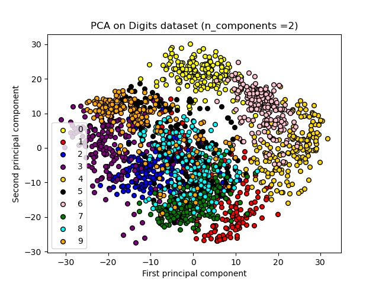

## Digits Dataset Overall accuracy

-Max Accuracy : 96.21380846325167
-Average Accuracy : 92.37193763919822

## Confusion matrix

- Confusing Digits - 8 and 1
- Easiest Digits to predict - 0 and 7

## Scatter plot

- We can infer that the images of same labels generally cluster near one other and so we see 10 distinct groups.
- The clusters which are separate from other clusters have less tendency to get confused with other clusters while predicting.
- So the digits - **0 (yellow) , 6 (pink) , 4 (gold)** tend to get easily predicted as they form separate clusters not mixing with other numbers.